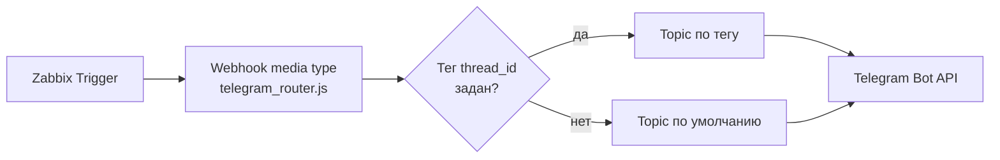

# Zabbix → Telegram Topic Router

Zabbix webhook media type для отправки алертов в Telegram-супергруппу с
включёнными топиками (Forum). Топик выбирается динамически — по тегу
`thread_id`, заданному на хосте или триггере, с резервным разделом по
умолчанию, если тег не задан.

Это обезличенная портфолио-версия рабочего решения: реальные `Token` и `To`
(chat_id) — секретные параметры конкретного медиатипа в Zabbix и в этот
репозиторий не попадают.

## Зачем

Без топиков все алерты Zabbix идут одной лентой, и на инфраструктуре в
несколько десятков хостов и тысячи триггеров это быстро становится
нечитаемым. Решение — развести алерты по тематическим топикам одной
супергруппы (сеть, Windows, Linux, бэкапы и т.д.), сохранив один медиатип
и один скрипт на всю Zabbix.

## Ключевая идея: тег вместо хардкода

Вместо того чтобы прописывать в скрипте список групп хостов и их топиков,
id топика хранится как **тег на хосте или триггере** (`thread_id: 1234`) —
и раскрывается в скрипт через макрос `{EVENT.TAGS.thread_id}`. Скрипт:

1. Проверяет, раскрылся ли макрос в реальное значение (не пустая строка и
   не осталась фигурная скобка `{...}` — признак того, что тег не задан).
2. Если да — использует его как `message_thread_id`.
3. Если нет — отправляет в `DEFAULT_TOPIC_ID`.

Плюс: чтобы завести новый хост в нужный топик, достаточно повесить на него
тег — без правки скрипта или медиатипа.

## Настройка

### 1. Telegram

- Создать бота через `@BotFather`, получить токен.
- Создать супергруппу, включить **Topics** (Group settings → Topics).
- Создать нужные топики, добавить бота с правом отправки сообщений.
- Узнать `chat_id` группы и id нужных топиков (например, отправив сообщение
  в топик и посмотрев `message_thread_id` через `getUpdates`).

### 2. Zabbix

`Administration → Media types → Create media type → type: Webhook`.

Вставить содержимое `telegram_router.js` в поле **Script**, задать параметры:

| Параметр | Значение |
|---|---|
| `Message` | `{ALERT.MESSAGE}` |
| `Subject` | `{ALERT.SUBJECT}` |
| `To` | chat_id целевой супергруппы |
| `Token` | токен бота |
| `message_thread_id` | `{EVENT.TAGS.thread_id}` |

Включить **Process tags**, чтобы тег `thread_id` доходил из хоста/триггера
до шаблона алерта.

На нужных хостах/триггерах добавить тег `thread_id` со значением id топика.
Для хостов без тега сработает `DEFAULT_TOPIC_ID` в скрипте.

### 3. Проверка

Кнопка **Test** в редакторе медиатипа — отправить тестовый payload с тегом
и без, проверить, что сообщение уходит в нужный/дефолтный топик.

## Безопасность

- `Token` и `To` — только в параметрах медиатипа Zabbix, никогда не в коде
  скрипта и не в этом репозитории.
- Если публикуете скриншот настроек медиатипа (как документацию) — обязательно
  скрыть/замазать поля `Token` и `To` перед публикацией.

## Стек

Zabbix (webhook media type, JavaScript/Duktape) · Telegram Bot API
